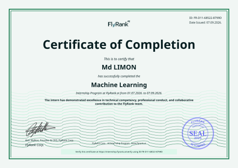

# Hi, I'm Limon

Full-Stack MERN Developer with hands-on experience in Machine Learning and AI. I build end-to-end web applications and apply data-driven modeling to solve practical problems.

## About Me

I develop full-stack applications using the MERN stack and have experience building machine learning models for classification and ranking tasks. My work covers responsive frontends, REST APIs, database design, data preprocessing, and model evaluation. I focus on writing clean, maintainable code and delivering functional, deployed projects.

## Technical Skills

**Frontend:** React.js, Next.js, JavaScript, TypeScript, Tailwind CSS, Redux / Redux Toolkit

**Backend:** Node.js, Express.js, REST APIs

**Database:** MongoDB, MySQL, PostgreSQL, Firebase, MongoDB Atlas

**Machine Learning / Data:** Python, Pandas, NumPy, Scikit-learn, NLP, CountVectorizer, Multinomial Naive Bayes, Random Forest

**Tools & Platforms:** Git, GitHub, Vercel, Render, Google Colab, Jupyter, Kotlin

## Machine Learning / AI

### Google Search Ranking & Discoverability — ML Research Capstone

*July 2026 – Present*

A research-stage machine learning workflow that prioritizes content pages for human review based on historical search-performance signals.

- Built a Random Forest classifier using `imp_prev30`, `clk_last30`, and `pos_last30` as features
- Defined a proxy decline label based on a 20% reduction in impressions
- Applied time-aware validation: training snapshot (April 30, 2026) and test snapshot (June 30, 2026)
- Final evaluation: ROC-AUC of 0.709, Accuracy of 60.85%
- Generated a ranked review queue using predicted decline probability
- Added transparent reason codes for each prediction
- Designed as decision support with human review — not automated content actions

## Featured Projects

### MERN E-Commerce Website with Stripe

JWT authentication, secure cookies, product listing, cart and order management, Stripe payment integration, admin dashboard, role-based access, MongoDB Atlas, deployed on Render.

**Live Demo:** https://ecommerce-tdcn.onrender.com

### Real-Time Chat Application

React, Redux Toolkit, Tailwind CSS, Node.js, Express, MongoDB, Socket.io, JWT.

Real-time messaging, typing indicators, message delivery and seen status, online/offline tracking, image sharing, JWT authentication.

**Live Demo:** https://chatting-application-ruddy-beta.vercel.app/

### Multi-Vendor E-Commerce Dashboard

**Live Demo:** https://multi-vendor-dashboard-ecommerce.vercel.app/

### Multi-Vendor E-Commerce Frontend

**Live Demo:** https://frontend-mern-multi-vendor-ecommerc.vercel.app/

### Email Spam Detection

Machine-learning-based text classification system that classifies emails as Spam or Ham using Python, Pandas, NumPy, Scikit-learn, NLP, CountVectorizer, and Multinomial Naive Bayes.

**GitHub:** https://github.com/limon-available/email-spam-detection

### WiFi Guardian

Android application developed using Kotlin.

## Certification / Internship

**FlyRank AI Internship in Machine Learning**

Completed practical assignments and a capstone project that was reviewed and accepted.

**Certificate Verification:** https://internship.flyrank.ai/verify/FR-D11-B1D73-E246F?first_name=Md

## Current Focus

- Building and deploying full-stack MERN applications
- Advancing machine learning research and model evaluation techniques
- Exploring system design and scalable architecture

## Contact

- Email: nazmulhossenlimon56@gmail.com
- GitHub: https://github.com/limon-available
- LinkedIn: www.linkedin.com/in/md-limon-24b656205/
